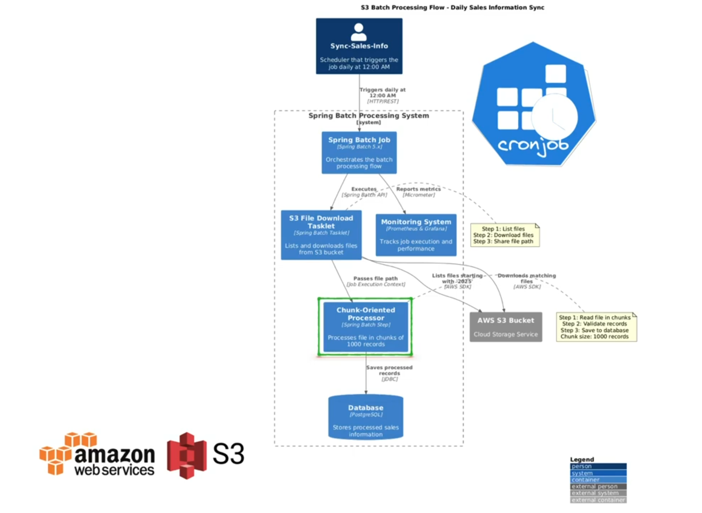

### Spring Batch AWS S3

This project demonstrates a Spring Batch job that downloads a CSV object from an S3-compatible storage (MinIO) using multipart transfers and ingests it into a PostgreSQL database.

Process flow:



### How it works

- **Step 1 — Download file from S3 (MinIO):**
  - The tasklet `DownloadFileTask` uses `CustomS3Client` to list objects in the bucket with the prefix `2025` and downloads the first match with AWS SDK v2 `S3TransferManager` (multipart-enabled transfer).
  - On success, it saves the downloaded file path into the Job Execution Context as `input.file.path`.
- **Step 2 — Parse CSV and persist to DB:**
  - A `FlatFileItemReader<SalesDTO>` reads the CSV columns: `saleId,productId,customerId,saleDate,saleAmount,location,country` (skips header line).
  - `SalesMapper` maps each `SalesDTO` to the JPA entity `SalesInfo`.
  - A `JpaItemWriter<SalesInfo>` writes rows into PostgreSQL.

Key classes:
- `job/ImportSalesInfoJob.java` — Declares the job with two steps: download, then read/process/write.
- `task/DownloadFileTask.java` — Fetch and store the local file path.
- `service/CustomS3Client.java` — S3 listing and multipart download using `S3TransferManager`.
- `domain/SalesInfo.java` — JPA entity persisted by the writer.

S3 settings are provided via `spring.cloud.aws.s3` with `path-style-access-enabled: true` to target MinIO. The bucket name defaults to `sales-info` and can be overridden via environment variables.

### Requirements

- Java 21
- Maven 3.9+
- Docker and Docker Compose
- MinIO Client CLI `mc` (see CLI reference) [CLI reference](https://docs.min.io/enterprise/aistor-object-store/reference/cli/)

### Project structure (high level)

- `src/main/java/.../job/ImportSalesInfoJob.java` — Job and steps definition
- `src/main/java/.../task/DownloadFileTask.java` — Tasklet step
- `src/main/java/.../service/CustomS3Client.java` — MinIO/S3 interactions
- `src/main/resources/application.yaml` — Spring configuration
- `docker-compose.yml` — Postgres and MinIO services
- `set-env.sh` — Convenience environment variables
- `2025_sales_data.csv` — Sample data file

### Configure environment

Use the convenience script to export environment variables used by Docker Compose and the Spring app:

```bash
source ./set-env.sh
```

Important variables set by the script:
- `MINIO_ROOT_USER`, `MINIO_ROOT_PASSWORD` — MinIO root credentials (for admin/`mc admin` actions)
- `MINIO_ACCESS_KEY`, `MINIO_SECRET_KEY` — Access keys the application will use
- `MINIO_URL` — S3 endpoint, defaults to `http://localhost:9000`
- `DB_URL` — JDBC URL for the application, e.g. `jdbc:postgresql://localhost:5432/sales`
- `DB_NAME`, `DB_USER`, `DB_PASSWORD` — Used by the Postgres container


### Start infrastructure (Postgres + MinIO)

```bash
docker compose up -d
```

This brings up:
- Postgres on `localhost:5432` with database `sales`
- MinIO server on `localhost:9000` and console on `localhost:9001`

### Install and configure MinIO Client (mc)

- Install `mc` (Linux x86_64 example):
  ```bash
  curl -sSL -o mc https://dl.min.io/client/mc/release/linux-amd64/mc
  chmod +x mc && sudo mv mc /usr/local/bin/
  mc --version
  ```
  For command reference, see: [CLI reference](https://docs.min.io/enterprise/aistor-object-store/reference/cli/)

- Set an alias to your local MinIO:
  ```bash
  mc alias set myminio http://localhost:9000 "$MINIO_ROOT_USER" "$MINIO_ROOT_PASSWORD"
  mc alias list | grep myminio
  ```

- Create the bucket configured in the app (default: `sales-info`):
  ```bash
  mc mb myminio/sales-info
  mc ls myminio
  ```

- Create access and secret keys for the application with an optional name and expiry (keys must not exceed the parent user’s permissions):
  ```bash
  # Example: create access keys named "spring-batch" valid for 30 days
  mc admin accesskey create myminio/ \
     --access-key "$MINIO_ACCESS_KEY" \
     --secret-key "$MINIO_SECRET_KEY" \
     --name spring-batch \
     --expiry-duration 30d
  ```
  Details: [mc admin accesskey create](https://docs.min.io/enterprise/aistor-object-store/reference/cli/admin/mc-admin-accesskey/mc-admin-accesskey-create/)

- Upload the sample CSV to a `2025` prefix so the job can find it:
  ```bash
  mc cp 2025_sales_data.csv myminio/sales-info/2025/2025_sales_data.csv
  mc ls myminio/sales-info/2025/
  ```

### Run the application

```bash
mvn -q -DskipTests spring-boot:run
```

On startup, the job will:
- List objects in `sales-info` with prefix `2025`
- Download the first match using `S3TransferManager` (multipart transfer for large objects)
- Parse and persist rows into Postgres

Alternative (build a jar):
```bash
mvn -q -DskipTests clean package
java -jar target/spring-batch-aws-telemetry-0.0.1-SNAPSHOT.jar
```

### Verify data load

```bash
docker exec -it postgres psql -U "$DB_USER" -d "$DB_NAME" -c "\dt" | cat
docker exec -it postgres psql -U "$DB_USER" -d "$DB_NAME" -c "select count(*) from sales_info;" | cat
docker exec -it postgres psql -U "$DB_USER" -d "$DB_NAME" -c "select * from sales_info limit 5;" | cat
```

### Multipart downloads (why and how)

- The project includes `software.amazon.awssdk:s3-transfer-manager` and `software.amazon.awssdk.crt:aws-crt`.
- `S3TransferManager` automatically performs concurrent multipart transfers for sufficiently large objects, improving throughput and resilience.
- Progress is logged via `LoggingTransferListener`.

### Configuration tips

- Bucket and prefix: Update the bucket in `application.yaml` and the listing prefix in `CustomS3Client` if needed.
- Credentials: Ensure the keys you create are attached to a user with permissions to `GetObject` and `ListBucket` for the target bucket.
- MinIO path-style: Keep `path-style-access-enabled: true` for MinIO compatibility.

### Troubleshooting

- Access denied or listing returns empty:
  - Verify the bucket name exists and the object is under the `2025/` prefix.
  - Confirm the app’s access keys are correct and have sufficient policy permissions.
- Connection issues:
  - Ensure MinIO is reachable on `http://localhost:9000` and that you set the alias with root credentials.
  - Verify `MINIO_URL`, `DB_URL`, and ports in `docker-compose.yml`.
- Database errors:
  - The app creates tables with `ddl-auto: create`. Ensure the Postgres container is healthy and the `DB_URL` points to it.

### TODO — Monitoring with Prometheus & Grafana

- Add dependencies: `spring-boot-starter-actuator` and `micrometer-registry-prometheus`.
- Expose metrics endpoint: set `management.endpoints.web.exposure.include=health,info,prometheus`.
- Run Prometheus and Grafana (docker-compose) and configure Prometheus to scrape the app’s `/actuator/prometheus` endpoint.
- Import a JVM/Spring dashboard in Grafana and set alerts as needed.

## TODO

A comprehensive list of technical TODOs is maintained in [TODO.md](./TODO.md).


## Contributing

Contributions and suggestions are welcome in the form of bug fixes and realism enhancements.! Please open issues or pull requests for improvements.

## License

This project is open source under the [MIT License](LICENSE).

### References

- MinIO CLI reference: [CLI reference](https://docs.min.io/enterprise/aistor-object-store/reference/cli/)
- Create access keys with `mc admin`: [mc admin accesskey create](https://docs.min.io/enterprise/aistor-object-store/reference/cli/admin/mc-admin-accesskey/mc-admin-accesskey-create/)
